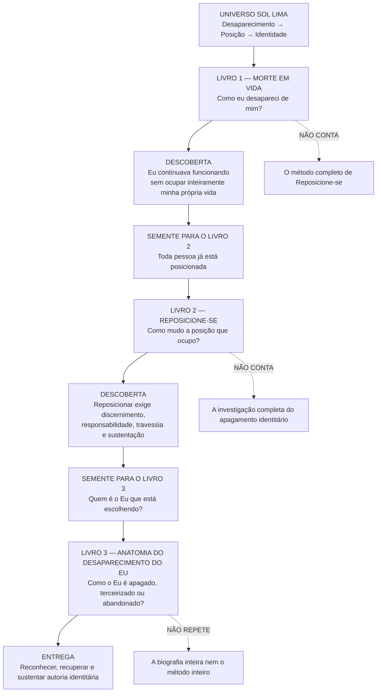
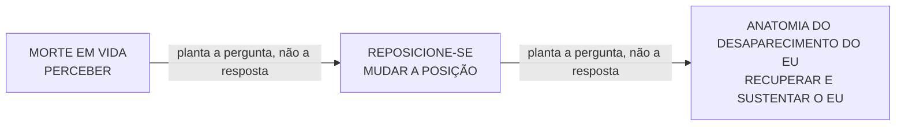

# MAPA VISUAL — TRILOGIA SOL LIMA

> Este arquivo é a visão panorâmica da trilogia. Os mapas detalhados de cada livro ficam em suas respectivas pastas.

## Regra de passagem

## Regra de ouro
Cada obra deve:
1. cumprir integralmente sua própria promessa;
2. usar somente as sementes necessárias do próximo livro;
3. não antecipar a resposta central da obra seguinte;
4. manter coerência com o cânone e a cronologia do Universo Mestre.

Versão visual inicial: 10/09/2026.