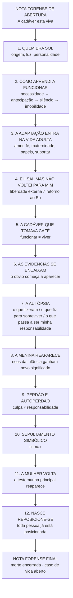
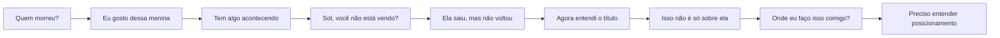
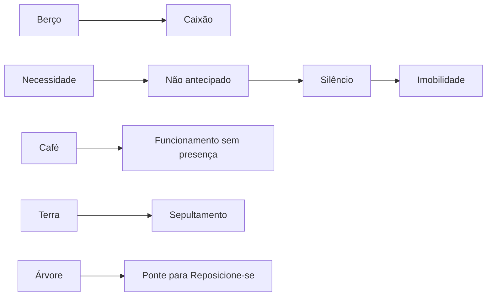

# MAPA VISUAL — MORTE EM VIDA

## Arco do leitor

## Símbolos estruturais

Este mapa mostra a ordem estrutural e a função das grandes partes. A ordem final dos capítulos será derivada das cenas consolidadas, não imposta artificialmente antes da apuração.