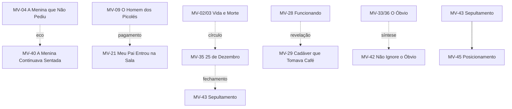

# MAPA VISUAL — CAPÍTULOS DE MORTE EM VIDA

Este arquivo mostra a sequência operacional de escrita. Para funções detalhadas, consultar `MAPA_CAPITULOS.md`.

## Abertura + Parte I

```mermaid
flowchart LR
A[MV-00 Nota Forense\nA Cadáver Está Viva] --> B[MV-01 Oito dias antes]
B --> C[MV-02 Dezoito de Julho]
C --> D[MV-03 Berço ao Lado do Caixão]
D --> I1[MV-I01 Reino das Galinhas]
I1 --> E[MV-04 A Menina que Não Pediu]
E --> F[MV-05 O Cheiro do Silêncio]
F --> G[MV-06 Eu Queria Ser um Anjo]
G --> H[MV-07 Os Dois Caminhos]
H --> I2[MV-I02 Mangas]
I2 --> J[MV-08 Primeira da Classe]
J --> K[MV-09 O Homem dos Picolés]
K --> I3[MV-I03 Caminho das Águas]
I3 --> L[MV-10 Quando a Água Quase Levou]
L --> M[MV-11 O Que uma Criança Aprende sem Aula]
```

## Parte II

```mermaid
flowchart LR
A[MV-12 Ser Boa Dava Menos Trabalho] --> B[MV-13 A Fé Como Casa]
B --> C[MV-14 O Altar e o Papel]
C --> D[MV-15 Ser Escolhida]
D --> E[MV-16 Mãe Antes de Mim]
E --> I4[MV-I04 Dueto com a Mãe]
I4 --> F[MV-17 O Acordo que Ninguém Escreveu]
F --> G[MV-18 A Régua Mudou de Lugar]
G --> H[MV-19 O que Eu Chamava de Paz]
H --> J[MV-20 A Ameaça]
J --> K[MV-21 Meu Pai Entrou na Sala]
K --> L[MV-22 A Porta que Eu Atravessei]
```

## Parte III

```mermaid
flowchart LR
A[MV-23 Depois da Porta] --> B[MV-24 O Recomeço que Parecia Diferente]
B --> C[MV-25 O Preço Atravessou Meus Filhos]
C --> D[MV-26 Um Filho do Outro Lado]
D --> E[MV-27 A Mãe sem o Filho]
E --> F[MV-28 Funcionando]
F --> G[MV-29 A Cadáver que Tomava Café]
G --> H[MV-30 O Amor sem Toque]
H --> I[MV-31 O Purgatório]
I --> J[MV-32 Meu Corpo Chegava Antes de Mim]
J --> K[MV-33 O Óbvio Estava na Sala]
K --> L[MV-34 Quando a Morte Voltou]
L --> M[MV-35 Vinte e Cinco de Dezembro]
M --> N[MV-36 A Casa e o que Não Tinha Nome]
```

## Parte IV + fechamento

```mermaid
flowchart LR
A[MV-37 O Dia do Perdão] --> B[MV-38 Autoperdão Não é Absolvição]
B --> C[MV-39 Quem Fez o Quê]
C --> D[MV-40 A Menina Continuava Sentada]
D --> E[MV-41 Os Lugares Onde Eu Me Abandonei]
E --> F[MV-42 Não Ignore o Óbvio]
F --> G[MV-43 O Sepultamento Simbólico]
G --> H[MV-44 A Testemunha Voltou]
H --> I[MV-45 Toda Pessoa Já Está Posicionada]
I --> J[MV-46 Nota Forense Final\nCausa da Morte]
J --> K[REPOSICIONE-SE\nPergunta, não resposta]
```

## Ecos estruturais

**Regra:** o mapa visual acompanha o `MAPA_CAPITULOS.md`. Mudanças importantes devem ser versionadas.