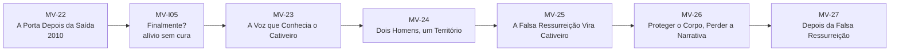
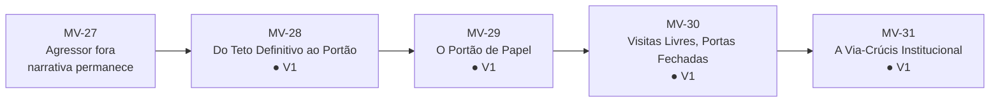
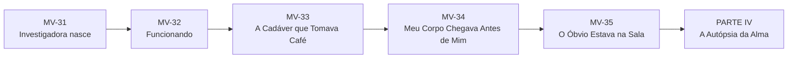
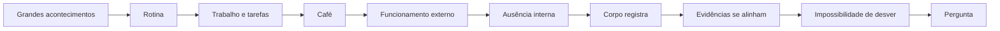
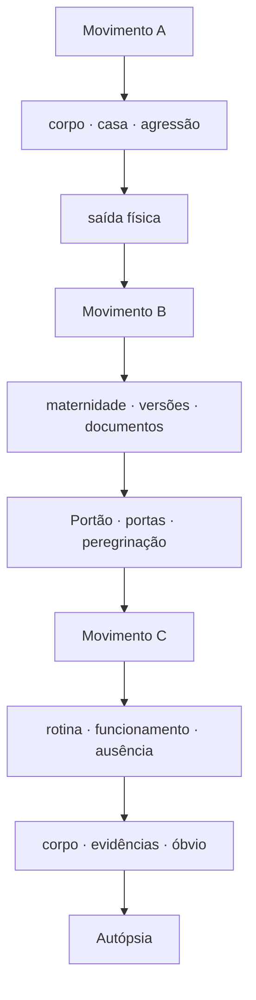
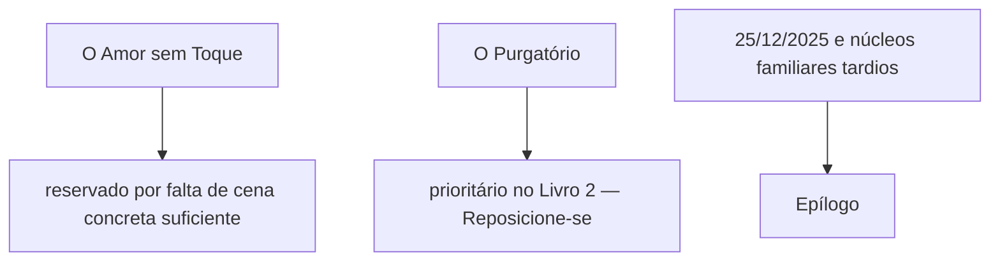

```mermaid
flowchart LR
A[Casinha / teto] --> B[Escola e rede familiar]
B --> C[Viagem planejada]
C --> D[Bicicleta / mudança de decisão]
D --> E[FÁ-MI-LIA]
E --> F[Acompanhamento]
F --> G[Orientação de afastar conflito]
G --> H[Caldas / trabalho / apartamento]
H --> I[Chave + vaga escolar]
I --> J[Retorno]
J --> K[Portão de ferro]
K --> L[Documento na secretaria]
L --> M[Vara / processo]
M --> N[Portão de papel]
N --> O[Visitas formalmente livres]
O --> P[Portas concretas fechadas]
P --> Q[Peregrinação]
Q --> R[Investigadora]
```

# MAPA VISUAL — PARTE III ATUAL
## A Cadáver que Tomava Café

**Atualizado:** 10/09/2026

## Movimento A — ETAPA 07 concluída

## Movimento B — ETAPA 08 concluída

## Movimento C — ETAPA 09

## Mudança de textura

## Construção do Portão — já paga

## Três mecanismos da Parte III

## Reservas conscientes

## Estado
- MV-I05 — ● V1
- MV-23 — ● V1
- MV-24 — ● V1
- MV-25 — ● V1
- MV-26 — ● V1
- MV-27 — ● V1
- MV-28 — ● V1
- MV-29 — ● V1
- MV-30 — ● V1
- MV-31 — ● V1
- MV-32 — ◑ arquitetura liberada
- MV-33 — ◑ arquitetura liberada
- MV-34 — ◑ arquitetura liberada
- MV-35 — ◑ arquitetura liberada

**Regra:** a Parte III termina quando a mulher já não consegue tratar os acontecimentos como fatos isolados, mas ainda não realizou a Autópsia completa.