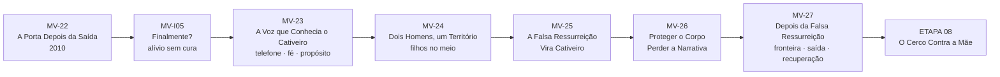
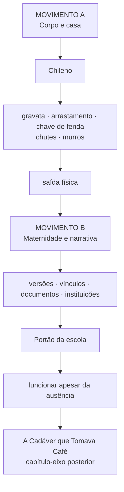
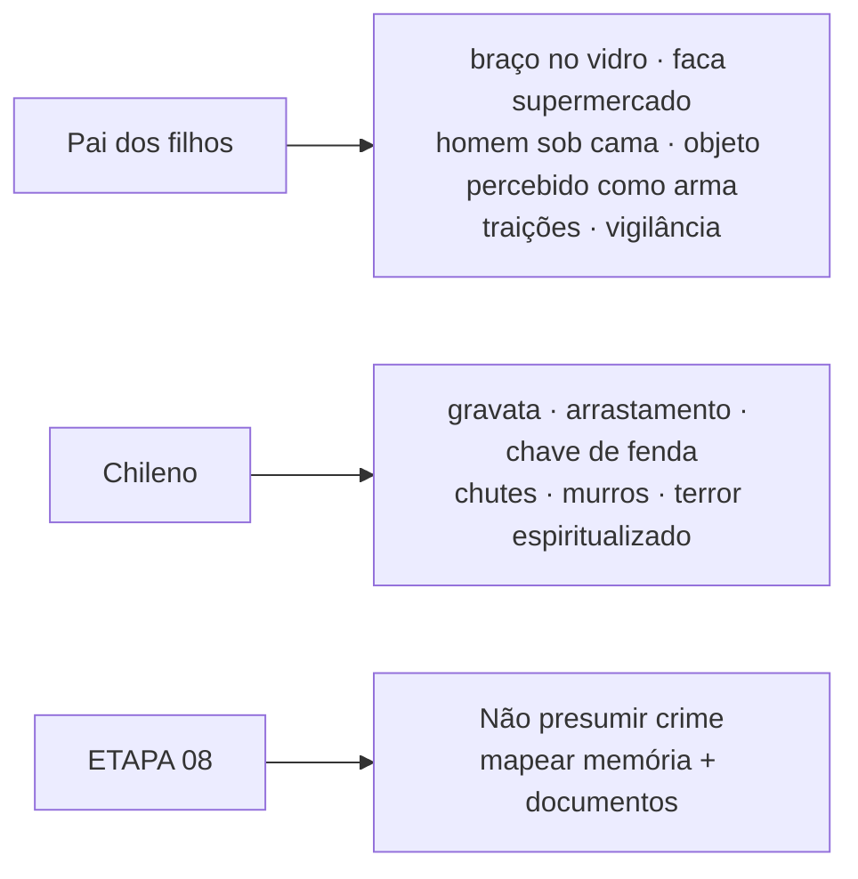

# MAPA VISUAL — PARTE III ATUAL
## A Cadáver que Tomava Café

**Atualizado:** 10/09/2026

## Movimento A — ETAPA 07 concluída

## Movimento emocional da ETAPA 07

## Duas formas de cerco

## Separação absoluta de autoria

## Estado
- MV-I05 — ● V1
- MV-23 — ● V1
- MV-24 — ● V1
- MV-25 — ● V1
- MV-26 — ● V1
- MV-27 — ● V1
- ETAPA 08 / Movimento B — ◐ próxima frente

**Regra:** o Portão da escola não é continuação da violência física do Chileno. Ele pertence a outro movimento: o cerco da maternidade por versões, vínculos, documentos e instituições.