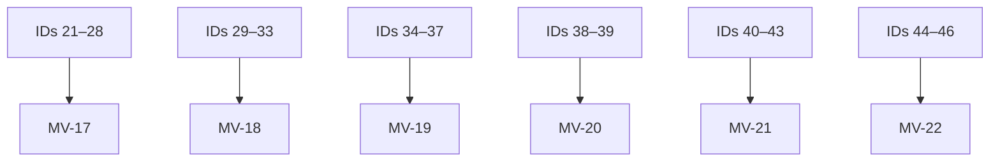
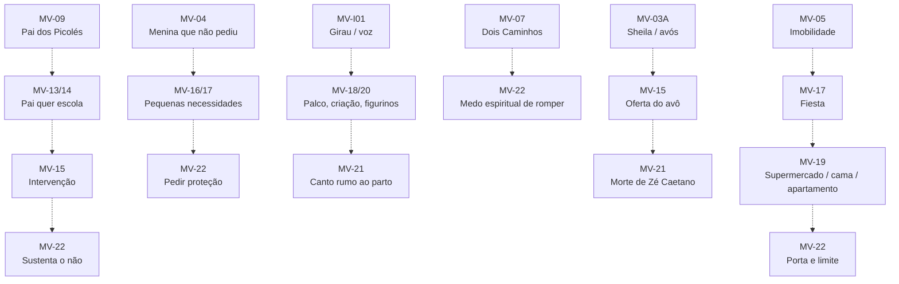

# MAPA VISUAL — PARTE II ATUAL
## Quando suportar ganhou nomes bonitos

**Atualizado:** 10/09/2026  
**Estado:** ● primeira escrita integrada.

```mermaid
flowchart LR
A[MV-11\nFecho da infância] --> B[MV-12\nEle Não Me Pediu Namoro\n13 anos · 02/05/1992]
B --> C[MV-13\nO Primeiro Bolo e A Boa Mesa\n14–15 anos]
C --> D[MV-14\nCongas Molhadas\nNoivado aos 15]
D --> E[MV-I04\nDueto com a Mãe]
E --> F[MV-15\nEmancipada Para o Altar\n16 anos · 09/09/1994]
F --> G[MV-16\nQuatro Cômodos sem Casa]
G --> H[MV-17\nA Cozinha no Fundo do Quintal\n1994–1998]
H --> I[MV-18\nO Leite que Não Chegava\nRio Quente · 2000]
I --> J[MV-19\nO Abraço no Supermercado\ninício dos anos 2000]
J --> K[MV-20\nNove Metros de Tecido\ncompetência e criação]
K --> L[MV-21\nDuas Vozes no Telefone\n2006]
L --> M[MV-22\nA Porta Depois da Saída\n2010]
M --> N[PARTE III\nA Cadáver que Tomava Café]
```

## Movimento emocional

```mermaid
flowchart LR
A[Ser vista] --> B[Ser escolhida]
B --> C[Ser celebrada]
C --> D[Receber uma função]
D --> E[Perder possibilidades]
E --> F[Tornar promessa pública]
F --> G[Atravessar o altar]
G --> H[Tentar construir]
H --> I[Tornar-se mãe]
I --> J[Trabalhar e criar]
J --> K[Normalizar e esconder]
K --> L[Enfrentar ameaça concreta]
L --> M[Continuar competente]
M --> N[Luto + nova maternidade]
N --> O[Sustentar um não]
O --> P[Fechar a porta]
P --> Q[Continuar escutando]
```

## Cobertura dos 26 núcleos da ETAPA 06

## Ecos estruturais

## Estado
- MV-12: ● V1
- MV-13: ● V1
- MV-14: ● V1
- MV-I04: ● V1
- MV-15: ● V1
- MV-16: ● V1
- MV-17: ● V1
- MV-18: ● V1
- MV-19: ● V1
- MV-20: ● V1
- MV-21: ● V1
- MV-22: ● V1

**Parte II:** ● primeira escrita integrada.  
**Ponte:** `a porta está fechada; o corpo continua escutando.`

**Regra:** este mapa visual prevalece sobre a seção antiga da Parte II em `MAPA_VISUAL_CAPITULOS.md` até a montagem do Manuscrito Alfa.