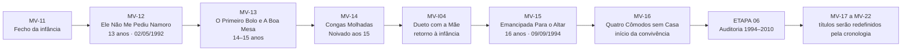
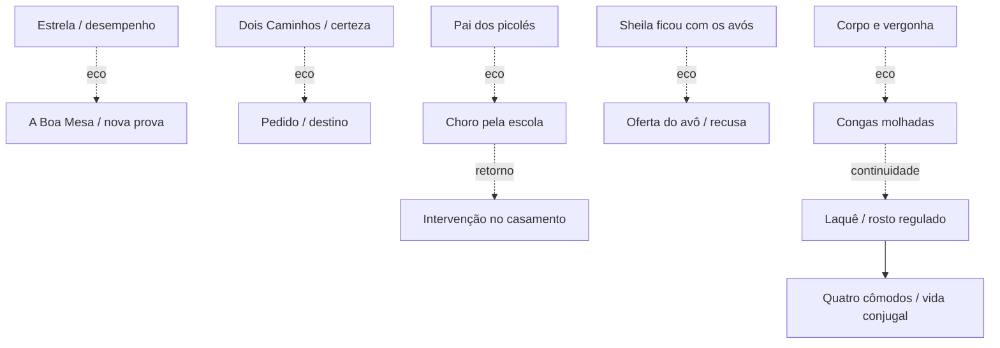

# MAPA VISUAL — PARTE II ATUAL
## Quando suportar ganhou nomes bonitos

**Atualizado:** 10/09/2026

## Movimento emocional

```mermaid
flowchart LR
A[Ser vista] --> B[Ser escolhida]
B --> C[Ser celebrada]
C --> D[Receber uma função]
D --> E[Perder possibilidades]
E --> F[Tornar promessa pública]
F --> G[Ter uma porta de saída]
G --> H[Recusar a porta]
H --> I[Atravessar o altar]
I --> J[Tentar construir uma casa]
```

## Objetos e retornos

## Estado
- MV-12: ● V1
- MV-13: ● V1
- MV-14: ● V1
- MV-I04: ● V1
- MV-15: ● V1
- MV-16: ● V1
- MV-17 a MV-22: ◐ aguardam auditoria da ETAPA 06

**Regra:** este mapa visual prevalece sobre a seção antiga da Parte II em `MAPA_VISUAL_CAPITULOS.md` até a montagem do Manuscrito Alfa.