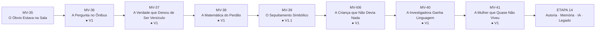
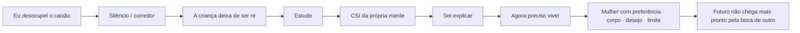
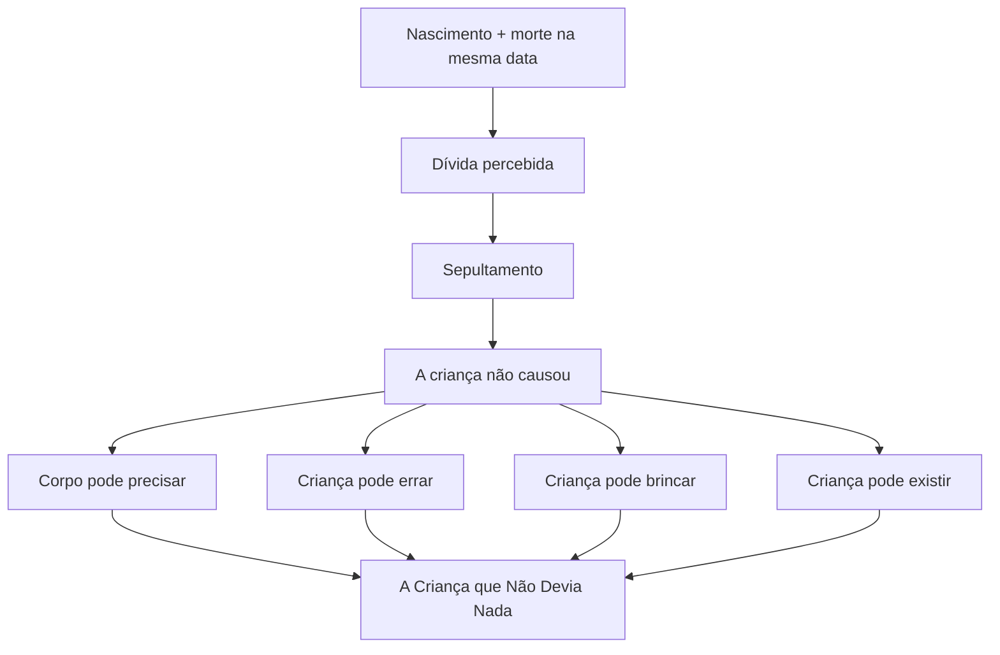
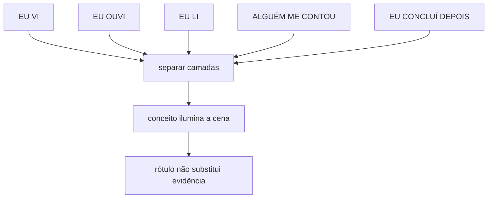
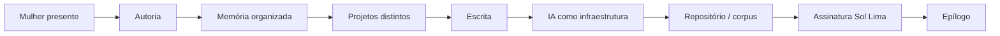

# MAPA VISUAL — PARTE IV ATUAL
## A Autópsia da Alma

**Atualizado:** 10/09/2026

## Fluxo atual

## Depois do clímax

## Reencontro com a criança

## Regra da investigadora

## Movimento da mulher — ✓ ETAPA 13

```mermaid
flowchart LR
A[Papéis e funções] --> B[Quem sou sem função?]
B --> C[Preferência]
C --> D[Corpo sem tribunal]
D --> E[Mulher Magnética\nexperiência formativa]
E --> F[Desejo sem direção automática]
F --> G[Limite]
G --> H[Presença]
H --> I[TCC\nlacunas documentais preservadas]
I --> J[Experiência observada]
J --> K[Magnetus\norganização posterior]
K --> L[Autorrelacionamento]
L --> M[Relacione-se\nconsequência]
```

## Próximo movimento — ETAPA 14

## Fronteiras
- criança = ternura sem infantilização;
- ciência não substitui fé;
- curso não vira autoridade clínica;
- diagnóstico não vira identidade;
- Mulher Magnética entra como experiência formativa, não terapia;
- TCC mantém curso/instituição/título/data em aberto;
- Magnetus aparece como fruto biográfico, não oferta;
- Relacione-se aparece como consequência, não publicidade;
- Reposicione-se não é ensinado;
- IA só entra na ETAPA 14 como infraestrutura, nunca autora.
