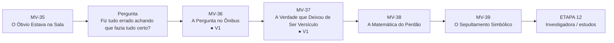
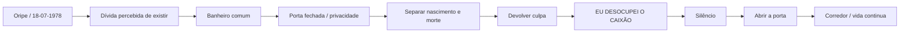
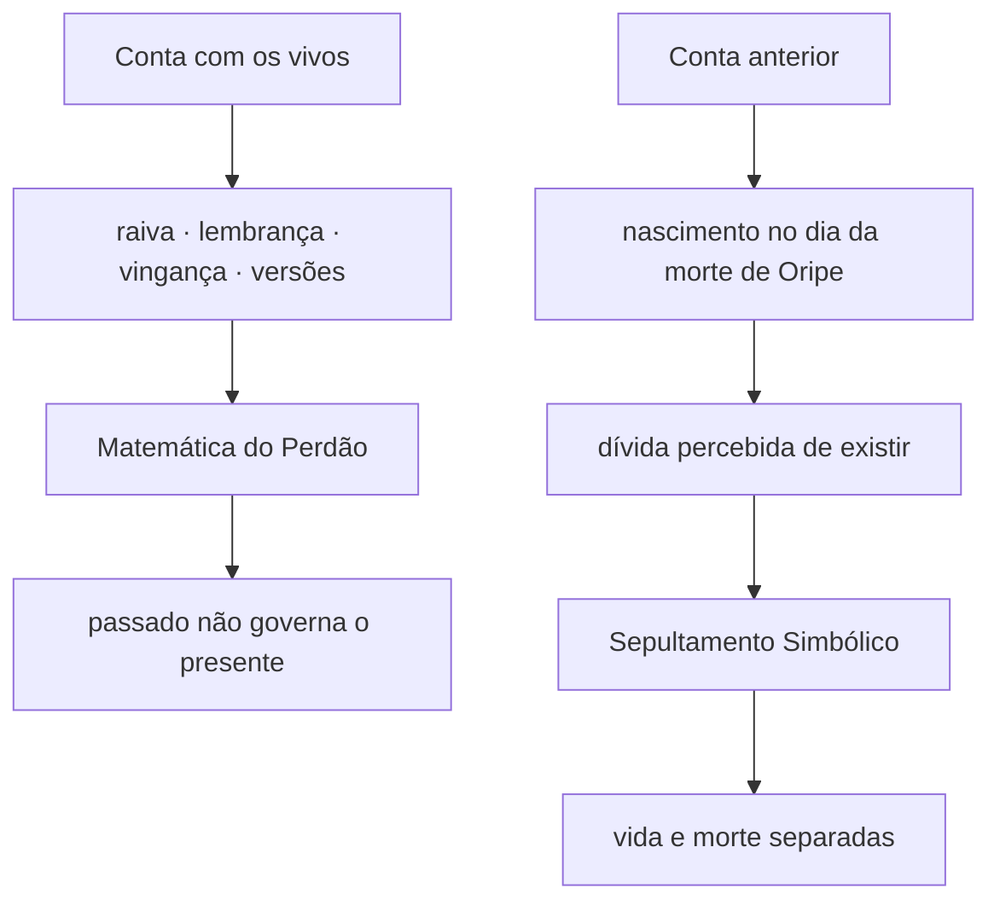
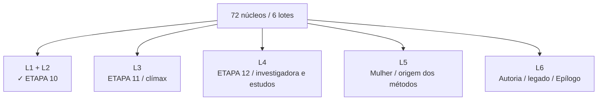

# MAPA VISUAL — PARTE IV ATUAL
## A Autópsia da Alma

**Atualizado:** 10/09/2026

## Entrada da Parte IV — ETAPA 10 concluída

## MV-38 — movimento

```mermaid
flowchart LR
A[Perdão impossível de sentir] --> B[70 x 7]
B --> C[490]
C --> D[490 leões internos]
D --> E[Perdão como decisão renovável]
E --> F[Verdade permanece]
F --> G[Limite permanece]
G --> H[Reconciliação não é exigida]
H --> I[Acesso não é devolvido]
I --> J[Passado perde governo]
J --> K[Oripe reaparece como dívida mais antiga]
```

## MV-39 — movimento

## Duas contas

## Regra do clímax

## Ato VI legado — destino

## Proteções
- 490 = formulação autoral, não terapia validada;
- perdão não exige reconciliação nem devolução de acesso;
- Oripe não é causa clínica;
- data/evento exatos do Sepultamento permanecem abertos;
- banheiro permanece comum e privado;
- `Eu desocupei o caixão` aparece uma vez no centro da cena;
- o livro continua depois do banheiro.
