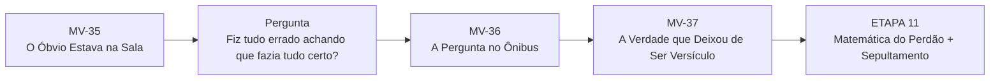
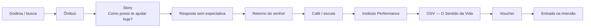
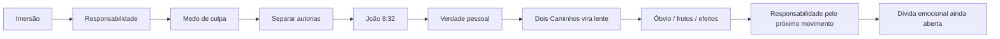
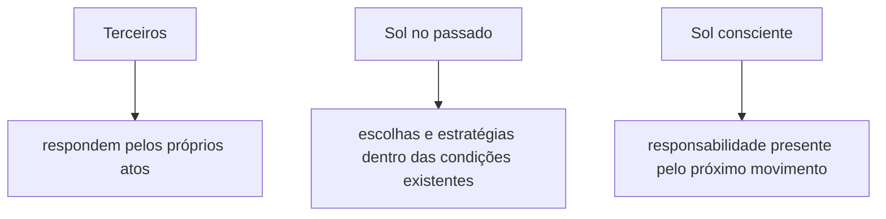
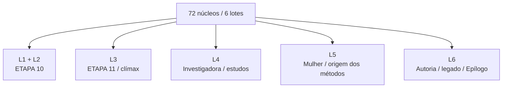

# MAPA VISUAL — PARTE IV ATUAL
## A Autópsia da Alma

**Atualizado:** 10/09/2026

## Entrada da Parte IV

## MV-36 — movimento

## MV-37 — movimento

## Três camadas de responsabilidade

## Ato VI legado — destino

## Regra
A Parte IV começa com **consciência**, não com vitória. Perdão e Sepultamento permanecem protegidos até a próxima etapa.