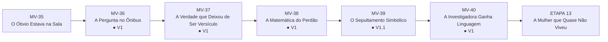
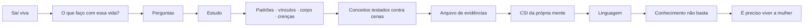
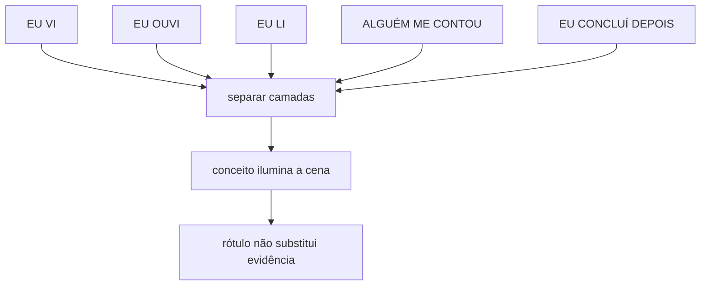
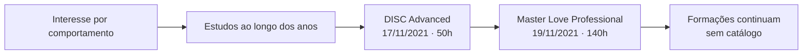
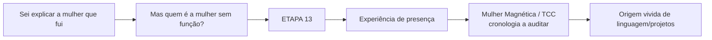

# MAPA VISUAL — PARTE IV ATUAL
## A Autópsia da Alma

**Atualizado:** 10/09/2026

## Fluxo atual

## Depois do clímax

## Regra da investigadora

## Marcos documentais mínimos

## Próximo movimento

## Fronteiras
- ciência não substitui fé;
- curso não vira autoridade clínica;
- diagnóstico não vira identidade;
- CSI não vira slogan;
- Reposicione-se não é ensinado;
- Mulher Magnética/TCC/Magnetus/Relacione-se ficam para a ETAPA 13.
