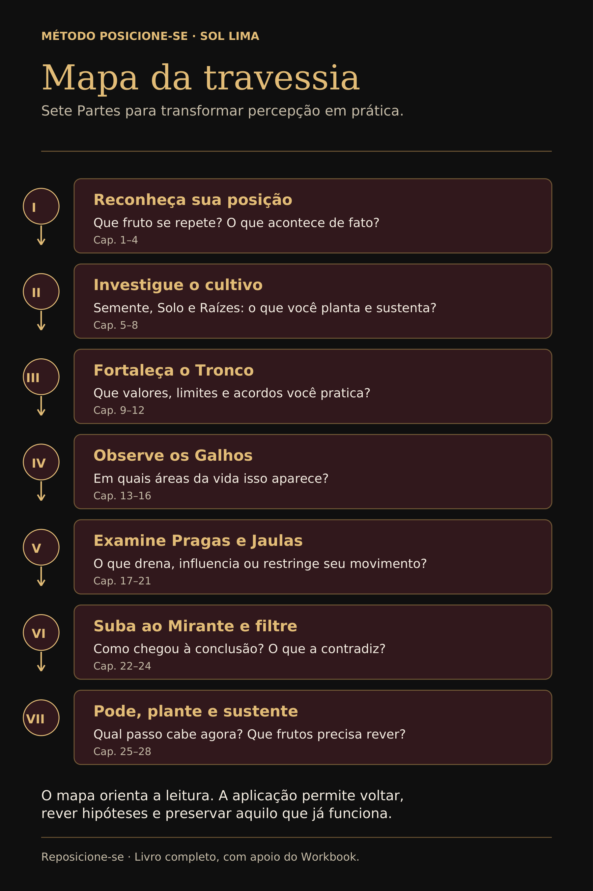
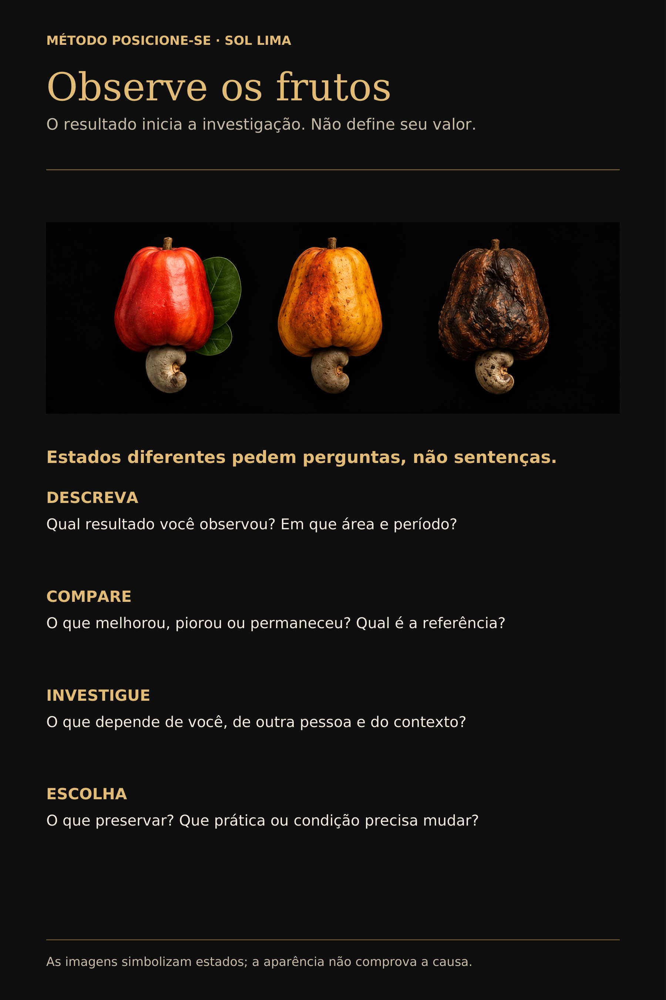
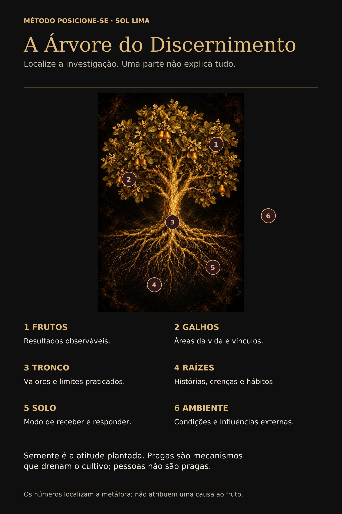

# REPOSICIONE-SE

## O mundo te ensinou a resistir, ninguém te ensinou a existir.

**Sol Lima**

---

# ANTES DE ME JULGAR

Antes de decidir se você concorda comigo, faça um acordo comigo.

Não concorde. Ainda não.

E também não discorde rápido demais.

Antes de me julgar, deixe seu julgamento na Árvore.

Não jogue fora. Não finja neutralidade. Não faça aquela educação de elevador em que a pessoa sorri por fora enquanto por dentro já decidiu que o outro é um imbecil.

Deixe ali por alguns minutos.

Suba na Árvore.

Olhe de cima.

Atravesse o raciocínio antes de reagir a ele.

Depois desça.

Se a sua perspectiva continuar a mesma, recolha o julgamento. Me confronte. Discorde. Feche o livro, se for o caso.

Eu prefiro perder um leitor que pensou a ganhar um seguidor que concordou sem pensar.

Não quero a sua obediência.

Quero o seu discernimento.

Este livro vai tocar em assuntos que quase todo mundo protege antes de examinar: família, amor, fé, dinheiro, trabalho, limites, pertencimento, política, imagem, responsabilidade, dor, influência, verdade.

Em algum momento, uma frase vai incomodar.

Incômodo não prova que eu estou certa.

Também não prova que estou errada.

Por isso existe a Árvore.

Debaixo dela, um galho pode ficar tão perto do rosto que parece a estrutura inteira. A mesma coisa acontece quando olhamos a vida de dentro de uma reação. O medo transforma possibilidade em ameaça. A culpa apresenta cobrança como dívida. A paixão encontra destino onde ainda existe uma pessoa que mal conhecemos. O ressentimento transforma qualquer pergunta em ataque. A autopiedade, quando assume o governo, consegue transformar sofrimento real em argumento para não mover mais nada.

Não estou pedindo que você abandone o que sente.

Estou propondo que você não entregue a uma emoção, a uma crença ou à opinião de outra pessoa o direito de encerrar a investigação antes da hora.

Guarde esse acordo.

Nós vamos precisar dele.

---

# A PROMESSA DESTE LIVRO

Eu não prometo que, ao terminar estas páginas, a sua vida estará resolvida.

Isso seria bonito na capa e irresponsável na vida real.

Também não vou prometer que você conseguirá cortar toda relação difícil, dizer não sem medo, enxergar cada manipulação, curar toda dor, mudar de carreira, ganhar mais dinheiro, consertar seu casamento ou descobrir em vinte minutos a raiz de tudo que repete.

Há livros demais prometendo uma versão humana sem atrito. Eu não conheço essa espécie.

A promessa deste livro é outra.

Ao terminar **Reposicione-se**, você deverá ser capaz de escolher uma situação concreta da sua vida, observar os Frutos que ela vem produzindo, reconhecer a posição que ocupa, investigar o que participa dessa posição e praticar um movimento possível — para depois voltar aos Frutos e verificar o que a mudança produziu.

Essa é a travessia.

Não é pensar bonito.

Não é aprender palavras novas para continuar fazendo exatamente a mesma coisa com vocabulário mais elegante.

É desenvolver discernimento suficiente para olhar, examinar, escolher, agir e revisar.

É metacognição aplicada à vida comum: perceber como você pensa enquanto pensa, reconhecer os filtros que participam da sua leitura e não entregar automaticamente o governo da decisão ao primeiro pensamento que apareceu.

É responsabilidade sem culto à culpa.

É limite sem transformar o mundo numa lista de bloqueados.

É empatia sem autoabandono.

É fé sem terceirização da consciência.

É reconhecer que outras pessoas e o ambiente participam dos resultados sem transformar todo mundo ao redor em culpado oficial da sua existência.

E é reconhecer sua margem de ação sem fingir que todo mundo dispõe da mesma liberdade, do mesmo dinheiro, da mesma segurança, da mesma informação ou da mesma rede de apoio.

Se este livro funcionar como deve, você não terminará pensando igual a mim.

Terminará mais capaz de perceber **por que pensa o que pensa, o que sustenta a posição que ocupa e que Frutos essa posição vem ajudando a produzir**.

Essa diferença importa.

Porque liberdade sem discernimento também pode ser apenas obediência com roupa nova.

---

# VOCÊ JÁ ESTÁ POSICIONADO

Mesmo quando acha que não.

O silêncio ocupa uma posição.

O adiamento também.

Pedir, recusar, aceitar, insistir, esperar, ceder, confrontar, permanecer, sair — tudo isso acontece de algum lugar.

Não conseguir agir naquele momento também descreve uma posição real, embora não necessariamente escolhida.

Até ficar em cima do muro exige que você fique em algum lugar.

E a vida continua acontecendo enquanto você está ali.

Este livro começou com o nome **Posicione-se**.

Depois precisei levar a sério uma coisa que o próprio método me mostrava: ninguém está fora de uma posição.

Você pode estar bem posicionado em uma área e mal posicionado em outra. Pode sustentar sua voz no trabalho e desaparecer dentro de casa. Pode ser firme com dinheiro e completamente governado pela aprovação. Pode ter uma vida que, vista de fora, parece uma fossa, mas estar genuinamente satisfeito com ela. Nesse caso, talvez você não queira mudar nada — e o livro não precisa criar um problema onde você não vê um.

Reposicionamento só faz sentido quando existe alguma distância entre os Frutos que você está colhendo e a vida que deseja sustentar.

Foi por isso que o título mudou.

Não parto da ideia de que você está sem posição.

Parto de uma pergunta:

**A posição que você ocupa está produzindo resultados coerentes com aquilo que você deseja, acredita e pode sustentar?**

Se está, ótimo.

Talvez haja o que preservar.

Se não está, discutir com o Fruto não basta.

Precisamos investigar o cultivo.

E antes que alguém transforme isso num discurso de culpa, uma distinção fica estabelecida desde agora: **posição não é consentimento**.

Examinar a sua participação numa situação não significa que você causou o comportamento de quem te feriu. Não significa que todo sofrimento teria sido evitado se você tivesse se posicionado melhor. Não significa que uma mulher ameaçada precisava apenas aprender limites, que alguém financeiramente dependente escolheu livremente permanecer ou que uma criança deveria ter encontrado recursos emocionais de adulto para se proteger.

A responsabilidade por uma violência pertence a quem a pratica.

O método não redistribui culpa para ficar bonito num diagrama.

Ele procura separar aquilo que é seu, aquilo que pertence ao outro, aquilo que vem do ambiente e aquilo que ainda não sabemos.

Essa separação é uma forma de respeito pela realidade.

---

# EU PRECISEI DESTE LIVRO

Este livro não nasceu de uma tarde criativa diante de um quadro branco.

Antes de existir método, existia uma mulher que funcionava muito e desaparecia em silêncio.

Eu resolvia, cuidava, suportava, reorganizava. Tentava de novo. Por fora, muita coisa continuava funcionando.

Esse é um dos aspectos mais traiçoeiros do apagamento: a vida pode continuar tão operacional que o sofrimento não encontra uma interrupção à sua altura.

Foi investigando minha própria história que comecei a perceber uma diferença entre sofrer e compreender o que o sofrimento estava organizando em mim.

A dor explicava muita coisa.

Mas a explicação não podia decidir sozinha o que viria depois.

Eu precisava distinguir medo de impossibilidade real, hábito de escolha, responsabilidade de culpa, esperança de repetição, empatia de autoabandono.

Precisava olhar para aquilo que eu sentia sem transformar o sentimento em governo absoluto.

E precisei confrontar uma praga que, na minha experiência, foi devastadora: a autopiedade.

Não estou dizendo que sofrer é se vitimizar.

Não estou dizendo que pedir cuidado é fraqueza.

Nem que uma pessoa ferida precisa levantar no dia seguinte sorrindo, produtiva e grata pela oportunidade de evolução — porque, francamente, às vezes a vida já bateu e ainda aparece um coach querendo bater com uma metáfora.

Estou falando de outra coisa.

Falo do lugar em que a dor, mesmo legítima, começa a organizar uma narrativa que me impede de perceber qualquer movimento possível.

*Coitada de mim.*

*Olha tudo que fizeram comigo.*

*Depois de tudo que sofri, como querem que eu...*

Durante muito tempo, essas frases me davam uma coisa sedutora: explicação sem movimento.

A dor virava prova de que eu tinha razão em permanecer exatamente onde estava.

E eu podia ter razão sobre muita coisa que fizeram comigo e, ainda assim, continuar presa.

Essa descoberta não anulou minha história.

Devolveu a ela uma pergunta nova:

**O que eu faço com aquilo que agora consigo enxergar?**

É dessa pergunta que nasce este livro.

---

# O LETREIRO DE NEON

Quando releio certos padrões da minha vida, encontro a imagem de um letreiro de neon aceso nas costas e na testa.

Não era uma placa que eu soubesse carregar. É a linguagem que encontrei depois para traduzir aquilo que minhas concessões, silêncios e dificuldades de sustentar limites tornavam visível.

Se o Letreiro pudesse falar, diria coisas assim:

*Eu carrego sozinha.*

*Se você pressionar o suficiente, eu cedo.*

*O meu não ainda pode ser negociado até desaparecer.*

Eu queria respeito.

Mas em algumas situações não conseguia sustentar aquilo que eu mesma dizia reconhecer como valor.

Foi daí que nasceu uma frase dura:

**Eu não era barata. O meu Letreiro anunciava liquidação emocional.**

Pare aqui, porque existe uma diferença que este livro não vai negociar.

O Letreiro nunca foi autorização para violência.

Ninguém recebe o direito de humilhar, trair, controlar ou ferir porque outra pessoa tem medo, dependência, dificuldade de limite ou uma história de sofrimento.

O Letreiro me ajudou a examinar outra coisa: que acessos eu concedia, que concessões repetia e o que conseguia sustentar quando reconhecer meu valor tinha um custo.

Não era ausência de valor.

Era distância entre valor e posição praticada.

E essa distância aparece em muitos lugares.

No amor.

No dinheiro.

No trabalho.

Na fé.

Na família.

Na vida pública.

Na internet.

Você pode dizer que valoriza seu tempo e continuar entregando a agenda para a urgência dos outros. Pode dizer que acredita em liberdade e repetir sem exame tudo que seu grupo pensa. Pode defender família e ferir justamente as pessoas que diz proteger. Pode ensinar limites e não conseguir sustentar um preço quando o cliente faz cara feia.

A boca apresenta um currículo.

Os Frutos entregam um relatório.

O relatório ainda precisa de contexto.

Mas merece ser lido.

---

# PELOS FRUTOS

Duas frases bíblicas atravessam meu modo de olhar para tudo isso.

**Pelos frutos se conhece a árvore.**

**Conhecereis a verdade, e a verdade vos libertará.**

A primeira me chama a olhar.

A segunda me convoca a levar a sério aquilo que vejo.

São lentes da minha fé, não fórmulas mágicas.

No Método Posicione-se, **Fruto é resultado observável**.

Não é identidade.

Não mede valor humano.

Não prova intenção.

Não revela sozinho a causa.

Mostra alguma coisa que merece investigação.

Às vezes o Fruto é uma repetição.

Às vezes é um bom resultado que você não sabe explicar.

Às vezes é uma dor.

Às vezes é um ganho que está cobrando um preço escondido.

Às vezes é simplesmente a constatação de que você não tem informação suficiente.

O método começa pelo Fruto porque explicações são excelentes advogadas daquilo que já acreditamos.

O Fruto é menos educado.

Ele aparece.

---

# A ÁRVORE DO DISCERNIMENTO

Sou cristã.

A Parábola do Semeador está na origem da imagem que me ajudou a organizar este método.

Na parábola, a semente é a palavra, a mensagem.

Eu preservo esse sentido bíblico.

A partir dele, faço uma adaptação autoral para a vida prática.

No **Método Posicione-se**:

- **Semente** é a atitude, decisão ou prática que você planta.
- **Solo** é o seu modo operante — o mindset, a maneira como você recebe, interpreta e responde.
- **Raízes** são histórias, crenças, hábitos, aprendizados e lealdades que sustentam esse funcionamento.
- **Tronco** representa aquilo que precisa sustentar a direção: valores, limites e capacidade de permanecer coerente quando existe custo.
- **Galhos** são as áreas e relações concretas em que a vida acontece.
- **Frutos** são os resultados observáveis.
- **Pragas** representam mecanismos que prejudicam o cultivo — internos ou externos — sem transformar pessoas em pragas.
- **Poda** é aquilo que precisa ser interrompido, limitado ou revisto.
- **Nova Semente** é uma nova atitude plantada de forma observável.
- **Mirante** é o movimento de ganhar perspectiva antes de concluir.

E existe ainda o **ambiente**.

O ambiente não é o Solo.

Ele é aquilo que está ao redor: regras, recursos, pressões, relações, oportunidades, restrições, riscos, apoio, cultura, tecnologia, dinheiro, poder.

Isso importa porque o problema nem sempre está “dentro de você”.

Você pode investigar Solo, Raízes, Tronco e descobrir que parte relevante do resultado vem de um ambiente que exige respostas impossíveis, de uma regra injusta, de uma relação coercitiva, de uma estrutura sem recurso ou de uma influência constante que merece ser examinada.

Mas cuidado.

Reconhecer influência não é transformar mãe, marido, chefe, igreja, amigos, internet ou sociedade em pragas ambulantes.

Pessoas são mais complexas que a função que exercem num problema.

O método precisa ensinar discernimento suficiente para dizer: *esta conduta me prejudica* sem precisar concluir *esta pessoa inteira é um lixo e precisa desaparecer da minha vida*.

Há situações em que afastamento é necessário.

Há outras em que o trabalho é aprender a permanecer inteiro na presença de alguém difícil.

Empatia não exige submissão.

Limite não exige desumanização.

---

# A JAULA QUE ESTAVA ABERTA

Durante muito tempo, a imagem que melhor traduziu minha mente foi uma jaula.

A porta estava aberta.

Mas eu continuava dentro.

E dentro da jaula havia um sofá.

Quentinho.

Conhecido.

Era o Sofá da Mentira.

Não da mentira que alguém me contava.

Da mentira que eu conseguia contar para mim mesma para não precisar atravessar o desconforto de uma mudança.

*Não adianta.*

*Eu sou assim.*

*Ele nunca vai entender.*

*Depois eu vejo.*

*Quando as coisas melhorarem, eu faço.*

*Eu não tenho escolha.*

Algumas dessas frases podem ser verdadeiras em determinada situação.

Por isso não quero que você saia do livro chamando toda permanência de covardia.

A pergunta é outra:

**A porta está realmente fechada — ou eu parei de verificar porque o sofá conhecido custa menos hoje?**

E, se a porta estiver fechada:

**Que condição eu preciso construir para ampliar minha margem com segurança?**

A Jaula não é um convite a abandonar tudo.

É um convite a distinguir impossibilidade real de permanência não examinada.

Essa diferença pode mudar uma vida.

---

# COMO USAR ESTE LIVRO

Você não precisa analisar sua existência inteira enquanto lê.

Escolha **uma situação concreta**.

Pode ser um relacionamento, um problema financeiro, uma dificuldade no trabalho, uma repetição familiar, uma decisão de carreira, um padrão de exposição na internet, uma questão de fé ou qualquer outro Galho em que exista um Fruto que você queira compreender melhor.

Vamos acompanhar essa situação ao longo da travessia.

Chamo esse primeiro registro de **Fotografia de Partida**.

Escreva:

**Galho:** em que área isso acontece?

**Fruto:** que resultado observável existe?

**Período:** em que intervalo você está olhando?

**Posição atual:** o que você faz, aceita, evita, sustenta ou não consegue fazer?

**O que eu ainda não sei:** que parte da história continua sem evidência suficiente?

Uma frase pode bastar em cada campo.

Exemplo:

**Galho:** trabalho.

**Fruto:** nas últimas seis semanas aceitei quatro prazos e entreguei três atrasados.

**Posição atual:** respondo antes de verificar a agenda.

**O que ainda não sei:** por que sinto tanta urgência em dizer sim e quanto do problema vem do volume real de trabalho.

Pronto.

Já temos algo melhor do que *minha vida está uma bagunça*.

Você não precisa de autópsia para toda terça-feira.

Precisa de precisão suficiente para fazer uma pergunta útil.

O Workbook reunirá os testes e fichas para quem quiser aprofundar o registro. O livro ensinará o raciocínio.

Não quero que você vire dependente de um formulário para viver.

Quero que aprenda a enxergar.

---

# A TRAVESSIA COMEÇA AQUI

Na primeira Parte, você aprenderá a observar a Vitrine da vida, dar endereço aos Frutos, reconhecer que já ocupa uma posição e criar espaço entre reação e escolha.

Depois entraremos em Semente, Solo e Raízes.

Mais adiante, veremos Tronco, Galhos, Pragas, Sofá, Jaula, influência, Filtro, Leis, Espelhos, Poda e Nova Semente.

Mas não quero que você memorize uma árvore inteira antes de aprender a olhar um fruto.

Método que despeja tudo no leitor de uma vez pode parecer completo e ensinar muito pouco.

Então começaremos simples.

Olhe a sua Fotografia de Partida.

Não explique tudo ainda.

Não procure o culpado oficial.

Não escolha a Raiz mais dramática.

Só responda:

**O que a minha vida está mostrando que a minha explicação preferida talvez não queira ver?**

É daqui que começamos.

E, por favor, não more na Árvore.

Você vai subir para enxergar melhor.

Depois vai precisar descer e viver.
