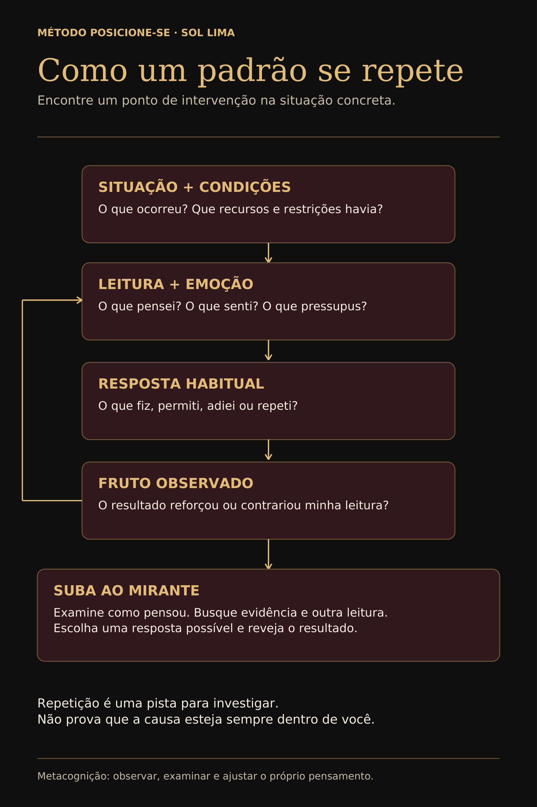
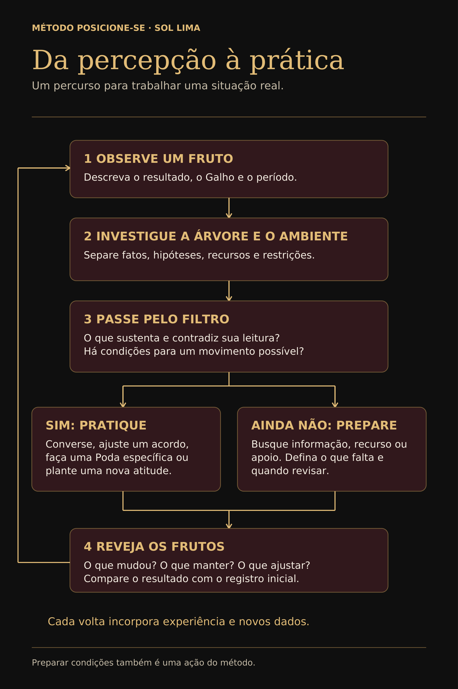

# CAPÍTULO 4 — O AUTOMÁTICO E A PRIMEIRA SUBIDA

## A resposta perfeita costuma aparecer no banho

Você já terminou uma conversa e, três horas depois, encontrou exatamente o que gostaria de ter dito?

No banho.

No carro.

Lavando louça.

Às duas da manhã, quando a outra pessoa já dormiu e você dá uma entrevista imaginária impecável para uma plateia inexistente.

Na hora, a resposta foi outra.

Você calou, explodiu, concordou, riu para aliviar ou pediu desculpa sem conseguir explicar pelo quê.

Depois veio uma compreensão que não estava disponível daquele jeito no momento da conversa.

É dessa resposta que chega antes de um novo exame que quero tratar aqui.

Nem todo automático é problema.

Você não precisa reaprender cada rotina conhecida toda manhã. Seria insuportável convocar uma reunião de diretoria interna para cada movimento cotidiano.

A pergunta do método é mais específica:

**Esta resposta continua adequada ao contexto em que está sendo usada?**

## O piloto automático não é vilão

Uma resposta aprendida pode ter protegido algo importante.

Imagine alguém que aprendeu a ficar quieto porque falar aumentava o perigo.

Anos depois, pode continuar antecipando silêncio diante de uma conversa difícil, mesmo num vínculo que permite discordância.

Ou pode ainda viver numa condição em que o silêncio oferece proteção real.

Não são a mesma situação.

Não precisamos insultar a resposta antiga.

Precisamos verificar a condição presente.

No começo de uma carreira, aceitar determinado trabalho pode ser uma escolha possível diante da necessidade de renda e experiência.

Em outro momento, o mesmo modo de aceitar prazos, preços e interrupções pode precisar de revisão.

Não sabemos apenas olhando o comportamento de fora.

Precisamos conhecer alternativas e custos.

Uma resposta não precisa receber o nome de trauma, defeito ou fraqueza para ser examinada.

Pode ser uma solução que serviu num contexto e continua sendo usada em outro.

## Lei 3 — Pense Antes de Reagir

Concordar com esta Lei é mais fácil do que praticá-la quando a emoção cresce, o grupo pressiona ou alguém toca exatamente no assunto em que você costuma responder sem intervalo.

**Pense Antes de Reagir** não significa virar frio.

Também não significa demorar três dias para responder bom dia porque agora você é um ser metacognitivo.

Significa criar, quando a situação permite, um espaço entre impulso e decisão.

Às vezes cabe uma pergunta.

Às vezes é necessário mais tempo.

Pode ser suficiente dizer:

*Preciso verificar antes de responder.*

Pode ser mais responsável dormir e retomar uma decisão importante no dia seguinte.

Não há um prazo universal.

Urgência real não é igual à pressa de encerrar desconforto.

A pausa serve para que a urgência de alguém — inclusive a sua — não decida tudo sozinha.

## Lei 4 — Desligue o Piloto Automático

Pensar antes de reagir cria o espaço.

Desligar o piloto automático usa esse espaço para verificar a resposta conhecida.

Pergunte:

**Se eu não repetisse imediatamente o que costumo fazer, o que precisaria examinar aqui?**

Talvez descubra um acordo que ainda não consultou.

Uma obrigação real.

Uma possibilidade que não considerava.

Talvez perceba que seu medo tem fundamento.

Talvez a resposta final permaneça a mesma.

Tudo bem.

O objetivo não é produzir novidade a qualquer custo.

É produzir uma decisão examinada.

Mudar só para provar que mudou também pode ser uma reação automática, agora fantasiada de evolução.

## O Mirante

Na abertura, o Cajueiro apareceu como uma imagem de estrutura e perspectiva.

Na Árvore do método, **Mirante** é o nome do movimento de tentar enxergar a situação sem ficar colado apenas à primeira leitura.

Não é uma parte mística da mente.

É uma metáfora para ganhar perspectiva.

Você não abandona a emoção.

Acrescenta distância suficiente para perguntar o que ela está fazendo na interpretação.

O Mirante não oferece neutralidade perfeita.

Oferece uma pergunta a mais antes da conclusão.

## Deixe na Árvore

A mensagem não chegou:

*Ele perdeu o interesse.*

A chefe chamou para conversar:

*Vou ser demitida.*

O vídeo teve pouco alcance:

*Meu conteúdo não presta.*

O filho não contou algo:

*Ele não confia em mim.*

Pode ser.

Ainda não sabemos.

**Deixe na Árvore** significa reconhecer a hipótese sem transformá-la em veredito.

Você não precisa expulsar a primeira explicação.

Precisa impedir que ela finja ser a única possível antes de examinar o que a sustenta.

Isso vale também para explicações confortáveis:

*Foi só uma vez.*

*Todo mundo faz.*

*Amanhã estará resolvido.*

O alívio de uma interpretação não prova sua qualidade.

## Uma subida guiada

Você começou uma Fotografia de Partida.

Observou a Vitrine.

Deu endereço ao Fruto.

Reconheceu a posição.

Agora percorra a mesma situação com mais atenção.

Não é necessário abrir um problema novo a cada pergunta.

Também não há obrigação de insistir numa situação que esteja te expondo ou exigindo um apoio que ainda não tem.

### 1. Observe o Fruto

O que aconteceu?

Em qual período?

Existe repetição?

Que informação ajuda a descrever a situação sem transformá-la numa sentença sobre alguém?

### 2. Localize o Galho

Em qual área isso aparece?

Vínculos, família, trabalho, dinheiro, marca, fé, vida pública ou outra?

Não faça um Galho representar a Árvore inteira.

### 3. Nomeie a posição atual

O que fez, aceitou, recusou, adiou ou não conseguiu fazer?

Descreva a resposta sem insultar sua identidade.

### 4. Separe fato, interpretação e emoção

O que você sabe?

O que concluiu?

O que sente?

Qual parte ainda precisa ser verificada?

### 5. Investigue a função da resposta

Essa posição pode estar evitando conflito, preservando renda, protegendo segurança, mantendo pertencimento ou repetindo uma rotina?

Não suponha que todo sofrimento tenha um ganho escondido.

Pode haver restrição real.

### 6. Localize custo e recurso

O que custa permanecer assim?

O que custaria mudar?

Que apoio, informação ou condição já existe?

O que falta de verdade?

### 7. Deixe o desconhecido na Árvore

Não invente origem nem declare intenção alheia só porque a emoção está convencida.

Escrever *ainda não sei* impede uma hipótese de assumir um cargo que a evidência não lhe deu.

### 8. Examine um movimento proporcional

Cabe pedir informação?

Consultar um acordo?

Propor um prazo?

Procurar orientação?

Observar uma repetição delimitada?

Há uma ação pequena cujas consequências sejam suficientemente conhecidas e revisáveis?

### 9. Desça

Escolha a resposta praticável.

Uma ação.

Uma preparação.

Uma espera consciente.

Não a vida inteira.

O próximo movimento dentro da sua margem real.

## Subir não é morar

Você pode aprender a explicar um padrão com vocabulário cada vez melhor e continuar repetindo a mesma resposta.

A análise vira endereço.

O Mirante vira cobertura de luxo da procrastinação.

Por isso, o comando não termina na subida:

**DESÇA DA ÁRVORE.**

Quando há informação suficiente para uma ação segura e proporcional, volte à vida.

Quando a análise só repete os mesmos argumentos e não acrescenta dado, talvez a próxima tarefa já não seja pensar mais.

Pode ser buscar uma informação específica.

Ou admitir que a conclusão precisa esperar.

Metacognição sem retorno à vida vira contemplação sofisticada do próprio umbigo.

E ninguém precisa subir tão alto só para continuar sentado.

## Descer não significa sair da situação

Esta distinção é indispensável.

Você pode descer da análise para buscar apoio e ainda permanecer onde está.

Pode decidir descansar antes de continuar.

Pode reconhecer que uma decisão exige avaliação especializada e procurar esse recurso.

Nenhuma dessas respostas obriga a confrontar alguém ou atravessar uma porta sem condições.

Se há ameaça, coerção, dependência, filhos, moradia ou outro risco relevante, a margem de movimento precisa entrar no centro da decisão.

Planejar, proteger informações, procurar rede de apoio e conhecer recursos podem ser mais necessários do que anunciar um limite.

Uma decisão irreversível não merece o mesmo tratamento de um teste cotidiano simples.

E a ausência de uma saída segura não deve ser convertida em falta de vontade.

**Desça da Árvore** significa voltar à realidade possível.

Não significa obedecer à pressa do livro.

## A Jaula está aberta

Talvez a primeira subida tenha tornado visível uma repetição que você conhecia, mas nunca havia formulado.

Um limite que desaparece.

Um preço que continua pagando.

Uma resposta que se repete antes de você perceber.

É nesse ponto que a imagem da Jaula começa a trabalhar.

A porta pode estar aberta.

Pode estar parcialmente aberta.

Pode estar trancada por uma condição concreta.

Pode haver um Sofá confortável demais dentro.

Não escolha uma resposta antes de investigar.

Pergunte:

**O que mantém essa permanência — e o que seria necessário para ampliar minha margem com segurança?**

A pergunta crescerá ao longo da travessia.

Agora ela só precisa impedir que você volte a chamar de invisível aquilo que já conseguiu ver.

## Lia experimenta um intervalo

Voltemos a Lia.

Ela aceita pedidos antes de verificar a agenda e depois se ressente.

Sua primeira leitura é que as pessoas abusam da sua boa vontade.

No Mirante, acrescenta uma pergunta:

**O que acontece entre o pedido e o meu sim?**

Percebe que quase não existe intervalo.

Ainda não conhece toda a lógica que sustenta a resposta.

Também não precisa inventá-la para testar algo pequeno num contexto sem risco identificado.

Diante de pedidos não urgentes, decide começar com uma frase:

*Vou conferir e te retorno.*

A frase não promete que aceitará.

Interrompe a decisão antes da consulta à própria capacidade.

Lia observará o que acontece com os pedidos, com a culpa, com a reação das pessoas e com a própria agenda.

A nova atitude será aprofundada mais adiante como **Nova Semente**.

Ela não precisa esperar o fim do livro para praticar o que já compreendeu.

## Checkpoint da Parte I

Releia sua Fotografia de Partida.

Atualize apenas o que conseguiu observar.

**Meu Fruto observável é...**

**O Galho em que ele aparece é...**

**Minha posição atual aparece assim...**

**O que ainda não sei é...**

Acrescente:

**O próximo passo que posso testar é...**

Ou:

**A condição que preciso reunir antes de agir é...**

Isso fecha a primeira subida.

Você não precisa ter resolvido a vida.

Precisa conseguir olhar uma situação com mais contorno do que a frase *minha vida está errada* oferecia.

Agora surge outra necessidade.

Uma posição não aparece no vazio.

Ela encontra um Solo.

É alimentada por Raízes.

É sustentada por um Tronco.

Acontece dentro de um ambiente.

Na Parte II, vamos entrar debaixo da superfície.

Sem transformar origem em destino.
