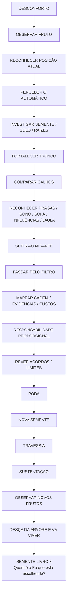
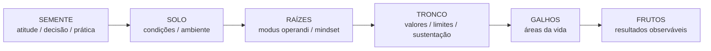
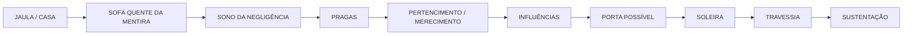
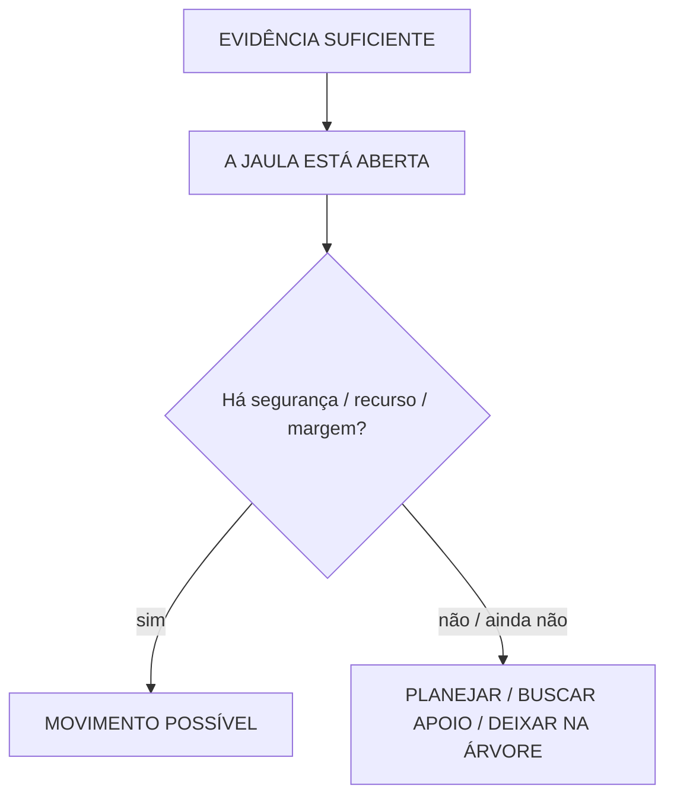
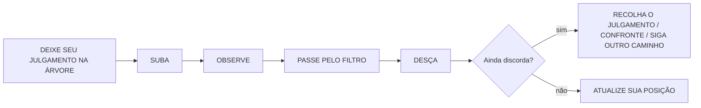
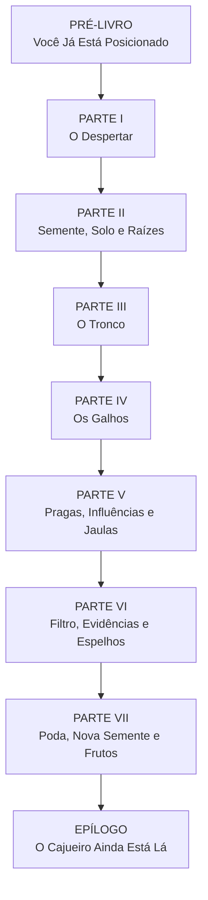
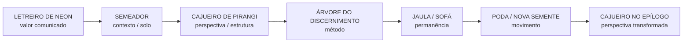

# MAPA VISUAL — REPOSICIONE-SE

**Estado vivo após ETAPA 01 — 10/09/2026**  
O snapshot anterior permanece em `ETAPAS/00_ESTRUTURA_BASE_2026-09-10.md`.

## 1. Travessia principal do leitor

## 2. A Árvore do Discernimento — método central

### Ordem simbólica do cultivo

> A ordem organiza a leitura; não afirma causa única ou linearidade psicológica rígida.

### Ordem da investigação

## 3. A Casa que virou Jaula — ambiente narrativo

### Comando transversal

**A JAULA ESTÁ ABERTA não significa `saia agora`.** Significa: pare de fingir que não viu e investigue a margem real de movimento.

## 4. Contrato intelectual

## 5. Arquitetura do livro

## 6. Patrimônio narrativo no arco

## 7. Fronteiras

- episódios de `Morte em Vida` entram apenas como exemplos breves;
- método completo fica no Livro 2;
- Fuga Identitária entra como pergunta/semente, não anatomia completa;
- Sepultamento Simbólico não vira ferramenta genérica do Livro 2;
- política é Galho de aplicação do discernimento, não palanque;
- o Livro 3 recebe a pergunta `quem é o Eu que está escolhendo?`.

## 8. Arquivos de apoio

- `BIBLIA_EDITORIAL_REPOSICIONE_SE.md`
- `DICIONARIO_CANONICO_DO_METODO.md`
- `LEIS_DO_POSICIONAMENTO.md`
- `MATRIZ_CAPITULOS_FUNCOES.md`
- `MAPA_10_PORCENTO_KINDLE.md`
- `MAPA_STORYTELLINGS.md`
- `MAPA_EXERCICIOS_TESTES.md`
- `MAPA_IMAGENS_ILUSTRACOES.md`

**Status:** arquitetura visual refinada e pronta para governar a ETAPA 02.
