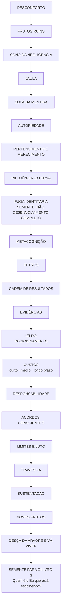
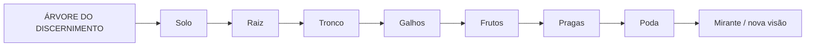
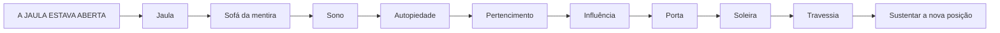

# MAPA VISUAL — REPOSICIONE-SE

## Duas metáforas que organizam o método

## Fronteiras
- Pode usar episódios breves de Morte em Vida como exemplos, mas não recontar a biografia.
- Deve entregar o método de reposicionamento por inteiro.
- Fuga identitária entra apenas no grau necessário para revelar a pergunta do Livro 3.
- Não resolve integralmente a anatomia do desaparecimento do Eu.

Status: arquitetura visual inicial criada em 10/09/2026.