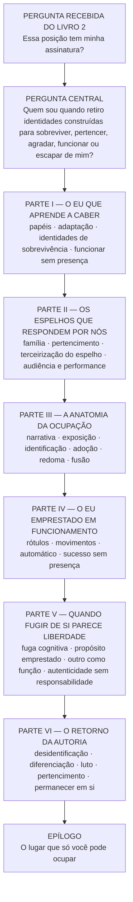
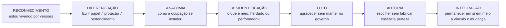
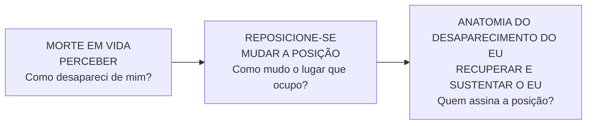
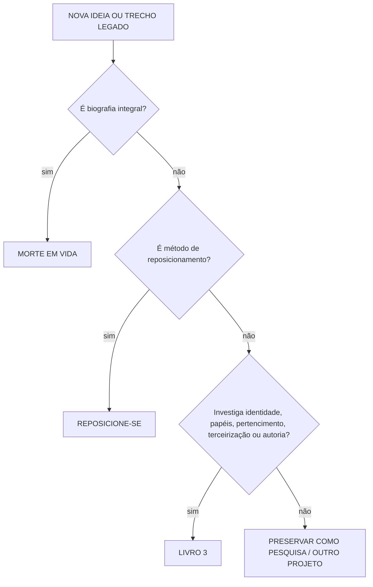

# MAPA VISUAL — ANATOMIA DO DESAPARECIMENTO DO EU

**Estado:** ETAPA 01 concluída — legado consolidado, arquitetura de 24 capítulos definida para produção.  
**Data:** 10/09/2026

## MOVIMENTO INTERNO

## RELAÇÃO COM A TRILOGIA

## REGRA ANTI-REPETIÇÃO

## REGRA DO LEGADO

`Camada 11 antiga ≠ manuscrito canônico final`

`Camada 11 antiga = reservatório de prosa + pesquisa + casos + ferramentas + figuras`

O reaproveitamento é governado por `MATRIZ_MIGRACAO_LEGADO_24_CAPITULOS.md`.
