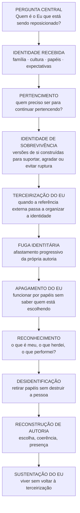

# MAPA VISUAL — ANATOMIA DO DESAPARECIMENTO DO EU

> Estrutura propositalmente aberta: este livro ainda está menos consolidado que os dois anteriores. O mapa preserva a pergunta central sem inventar uma arquitetura fechada prematuramente.

## Relação com os livros anteriores

## Fronteiras provisórias
- Não recontar integralmente Morte em Vida.
- Não repetir o método completo de Reposicione-se.
- Aprofundar identidade, pertencimento, papéis, terceirização, fuga e recuperação de autoria.
- Tratar fenômenos contemporâneos apenas quando ajudarem a pergunta humana central, evitando transformar o livro em ensaio genérico sobre sociedade.

Status: mapa conceitual inicial; arquitetura final ainda a desenvolver.